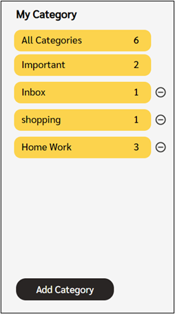
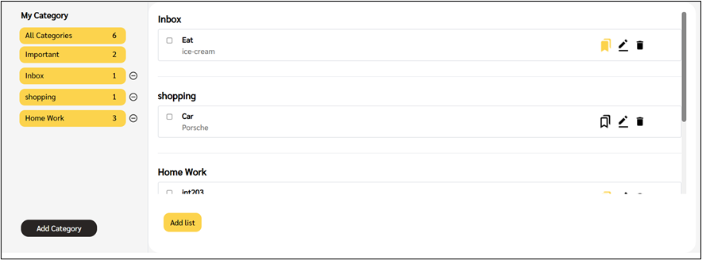
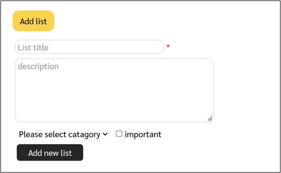
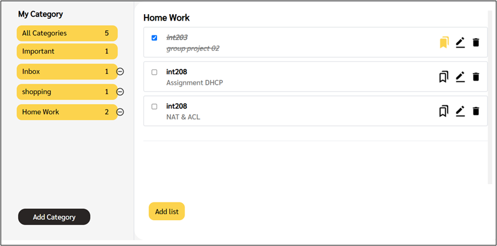
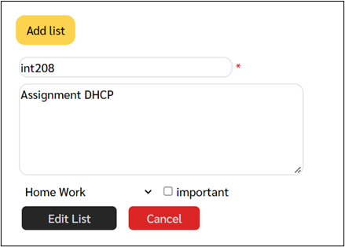
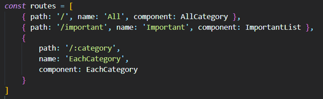
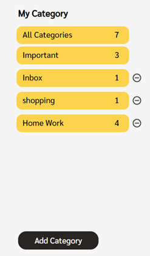
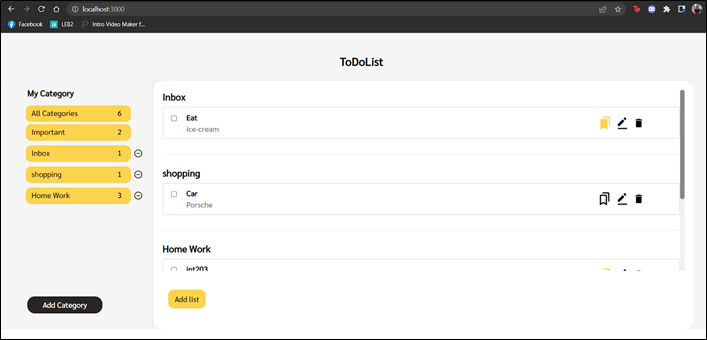
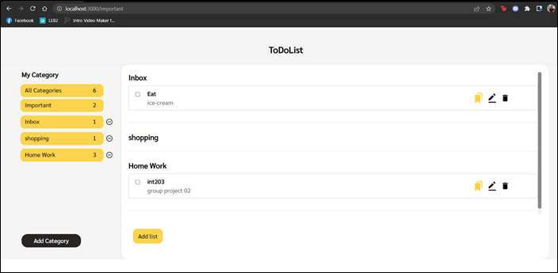

# sec-3-group-8-todolist
# Application ToDoList
### ลักษณะของ application
เเอพพลิเคชั่นที่ช่วยจดบันทึกรายการที่ต้องทํา สำหรับ user ที่ต้องการจดไว้เพื่อกันตนเองลืม โดยที่ user สามารถจัดหมวดหมู่ list ตามที่ต้องการได้ เเละยังสามารถเลือกติดดาวให้กับ list ที่มีความสำคัญได้ (important)

### function ใน application
1. สามารถเพิ่มเเละลบหมวดหมู่ที่ต้องการได้ 
   * มีเลขเเสดงว่าในเเต่ละหมวดหมู่มีรายการที่ยังทําไม่เสร็จกี่รายการ รวมถึงมีการสรุปจำนวนรายการทั้งหมดเเละรายการที่เป็น important ด้วย
   * จะมี Category ตั้งต้นมาให้เมื่อเข้ามาใช้งานครั้งเเรก ซึ่งก็คือ Inbox
   
   
   > ฝั่งซ้ายมือของหน้าเว็บจะเป็นส่วนของ List Category สามารถเพิ่ม/ลบ Category เเละดูจำนวนรายการของเเต่ละหมวดหมู่ได้ที่นี่
  
2. สามารถเลือกดูได้ว่าในเเต่ละหมวดหมู่มี list อะไรที่เราสร้างไว้อยู่บ้างโดย
   * 3.1 All category - หมวดที่จะแสดง list ทั้งหมด ของทุกหมวดหมู่ที่มีใน ToDoList
   * 3.2 Important - หมวดที่จะแสดงจะเเสดงเฉพาะ list ที่กดสัญลักษณ์ bookmark ในหมวดหมู่นั้นๆ

   
   > ฝั่งซ้ายมือจะเเสดง list ตาม Category ที่เราได้กดเลือก อย่างรูปนี้เป็นการเลือกดู All category
   
3. List ที่เเสดง สิ่งที่เเสดงประกอบด้วย
   * ชื่อ list
   * คําอธิบายของ list 
   * Important ของ list
   * Edit ของ ist (สามารถเเก้ไขรายละเอียดต่างๆได้)
   * ถังขยะ(สามารถลบ list ออกไปได้)

   

4. สามารถเพิ่มรายการที่ต้องทําได้โดย
   * กรอกชื่อ list
   * กรอกคําอธิบายของ list 
   * เลือกหมวดหมู่ของ list ที่ต้องการจัดเก็บ
   * สามารถกดที่รูปดาว เพื่อให้รายการนั้น อยู่ในหมวด important ได้ โดยที่ important เป็นหนึ่งในหมวดที่     มีมาให้ตั้งแต่แรกอยู่แล้ว
   
   
   > เมื่อกดที่ปุ่ม Add List จะมีฟอร์มขึ้นมาให้กรอกข้อมูลการเพิ่ม list ตามรูป
  
5.สามารถติ๊กเพื่อบอกว่าทํา list นั้นสําเร็จไปเเล้วได้
   * เมื่อติ๊กเเล้วระบบจะขีดฆ่า list อันนั้นทิ้ง เเต่จะยังไม่ทําการลบออกไป ถ้าต้องการที่จะลบให้ทําการคลิกที่รูปถังขยะเพื่อลบ
   
   
   > เมื่อทำการติ๊กว่า list นี้ทำเสร็จเเล้ว ฝั่งซ้ายมือจะลบจำนวน list ลงตามไปด้วย
   
6.สามารถเเก้ไข list ของเราได้(เพิ่มเข้ามาในการส่งงานครั้งนี้)
   * เเก้ไข ชื่อ list ได้
   * เเก้ไข คําอธิบายของ list ได้
   * เเก้ไขหมวดหมู่ของ list ที่ต้องการจัดเก็บได้
   * เเก้ไข Important ของ list ได้
   
   
   > เมื่อกดที่สัญลักษณ์ Edit ของเเต่ละ list จะมีการเเสดงฟอร์มที่มีข้อมูลเก่าของ list นั้นๆให้เเก้ไข เเล้วกด Edit List

### เเก้ไขจาก comment อาจารย์ครั้งที่เเล้ว
 * เปลี่ยน icon จากรูปดาวเป็นรูป Bookmark เเทน ในส่วนของ Important ของ list

### Router+View ใน application
 * มีทั้งหมด 3 path ด้วยกัน เเละมี view ทั้งหมด 3 view คือ Allcategory.vue ImportantList.vue เเละ ImportantList.vue

    
     

#### ในหน้าเว็บของเราจะมีให้เลือก category ดังนี้
  
 
1. ถ้าคลิกที่ All Category จะไปเรียกใช้งาน AllCategory.vue เเละ path ของ URL จะตามด้วย /
ใน AllCategory.vue จะวนลูปแสดง categoryเเละ list ใน category นั้นๆทั้งหมด

> เมื่อคลิกที่ All Category จะมีการเรียก router ที่มี path เป็น / เเละเรียกใช้ view Allcategory.vue
  
2. ถ้าคลิกที่ Important จะไปเรียกใช้งาน ImportantList.vue เเละ path ของ URL จะตามด้วย /Important
ใน ImportantList.vue จะวนลูปแสดง list พร้อมทั้งชื่อ category  ที่ทําเครื่องหมายว่า Important เอาไว้

> เมื่อคลิกที่ Important จะมีการเรียก router ที่มี path เป็น /important เเละเรียกใช้ view ImportantList.vue
  
3. ถ้าคลิกที่ Category อื่นๆ จะไปเรียกใช้งาน EachCategory.vue เเละ path ของ URL จะตามด้วย /[ชื่อcategoryนั้นๆ]
ใน ImportantList.vue จะวนลูปเเสดง list ใน category ที่เลือกเท่านั้น

  
 ### Component ใน application
เเบ่งออกเป็นทั้งหมด 2 component ด้วยกัน
1. AddNewList.vue
เป็น component ที่ใช้สำหรับการเพิ่มเเละเเก้ไข list ตามที่ต้องการ โดยจะมี editMode() คอยควบคุมว่าตอนนี้กำลังทำการเพิ่มหรือเเก้ไข list อยู่

2. CategoryList.vue
เป็น component ที่ใช้สำหรับการเเสดงรายการ category ทั้งหมด โดยจะมีการรับ array ของ category มาวนลูปเเสดงพร้อมทั้งใส่ router-link ให้เเต่ละ category สามารถ click เเล้วเเสดงรายการ list ทั้งหมดของ category นั้นๆได้

### vue.js
เป็นไฟล์เก็บ method รวมถึงการ GET ข้อมูลจาก server ที่หลายๆ component ต้องใช้เเละ export ออกไป เพื่อไม่ให้มีการเขียน code ซ้ำๆ

### App.vue
App.vue เป็นส่วนที่เรียกใช้ Component CategoryList.vue
